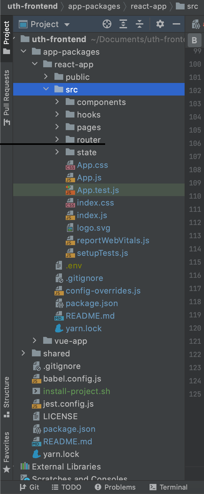

# uth-frontend
The frontend solution for the "Under the Hood" series which you can find it [here...](https://www.youtube.com/channel/UCQDzXdGi-B2lXz4dRJVIF-w)
The series is about reviewing all Javascript Frameworks/Libraries. Each app will be a todo app in order to easily compare and review the Frameworks.

Once the series is complete, I will link my framework's repo/source code here. 
The goal of this series is to learn, grow and develop my own framework. 
I appreciate any support and contribution. 

Thanks! I hope you enjoy the series.
------
### Frameworks & Technologies
- ### [React](https://reactjs.org/)
  
    **"A JavaScript library for building user interfaces"** ~ React.org

    With a large community and backing React is a great option to build flexible & scalable interactive UI.
---
- ### [Vue](https://vuejs.org/)
  
    **"The progressive JavaScript Framework"** ~ Vue.org

    Vue aims to be "progressive", easy to adopt, dev friendly but powerful.
    Vue has been and continues to gain plenty of steam as a top option for building interactive UIs.
  
---
- ### [Angular](https://angular.io/)
  
    **"One framework. Mobile and desktop."** ~ Angular.io

    A tried and true framework that has been around for a very long time but for good reason.
    Angular, built for large scale in mind very opinionated but with that comes a stable framework that holds up to any challenge.
  
--- 
- ### [Svelte](https://svelte.dev)
  
    **"Cybernetically enhanced web apps"** ~ Svelte.dev
  
    The tagline may confuse you but make no mistake Svelte is here and here to stay. 
    Svelte takes a whole different top-down approach to Frameworks in JS. 
    It's difference in philosophy and implementation draws attention especially but that attention is backed by great, effective results.
  
---
- ### [Solid.js]()

    **"A declarative, efficient and flexible JavaScript library for building user interfaces." ~ Solidjs.com**

    A purely reactive library that pulls a lot of ideology from React. 
    However, unlike React, Solid is truly Reactive, fast, and uses **no Virtual DOM**.
    Its hard not to see Solid as a React 2.0, but it does appear to be able to standalone as a top tier contender.
    A contender that may be here to stay for a very long time.


-----

## Installation

You will need npm & yarn in order to run all applications. Fork the repo and navigate to the root of the project **(uth-frontend)**.

Run the followings to install all necessary packages for all Apps.

```
$ cd uth-frontend
$ yarn install:projects
```

**If package is not included or install fails ctrl-C to stop installation**.
At this point you will need to manually install the app you desire to run.
For example if you wish to run the React app run the following:

```
$ cd uth-frontend/app-packages
$ cd react-app
$ yarn install
```

## Getting Started

You can navigate to an individual project and run ``yarn start`` in order to spin up the application.
Or you can from the root directory **(uth-frontend)** easily run 

`yarn start:[framework]-app`.

Where **[framework]** would be replaced with the name of the Framework/Library you wish to view.

**Ex start script:**

```
$ cd uth-frontend
$ yarn start:react
``` 

**Or navigate into the app directory and run `yarn start`**

```
$ cd uth-frontend/app-packages
$ cd react-app
$ yarn start
```
will run the React dev server and navigate you to the running application.

## Folder Structure



- `app-packages`: holds all individual app projects organized by the **framework/library** name followed by hyphen app

    - react-app
    - vue-app
    - angular-app
    - svelte-app
    - solid-app
    
- `shared`: this file will continue all constants, services, utils & helpers that will be shared across the individual app packages.

The individual app packages will continue slight differences in folder structure but you will always find:
- `src/state`
- `src/router`
- `src/components`

These reoccurring folders will be in each app package.


## Issues


## Resources
